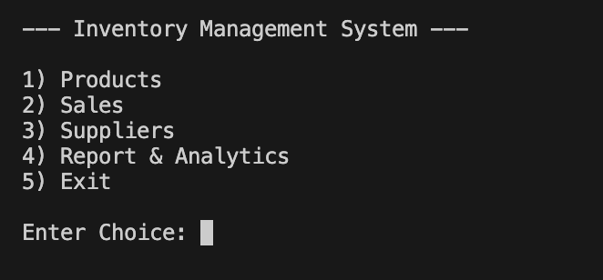
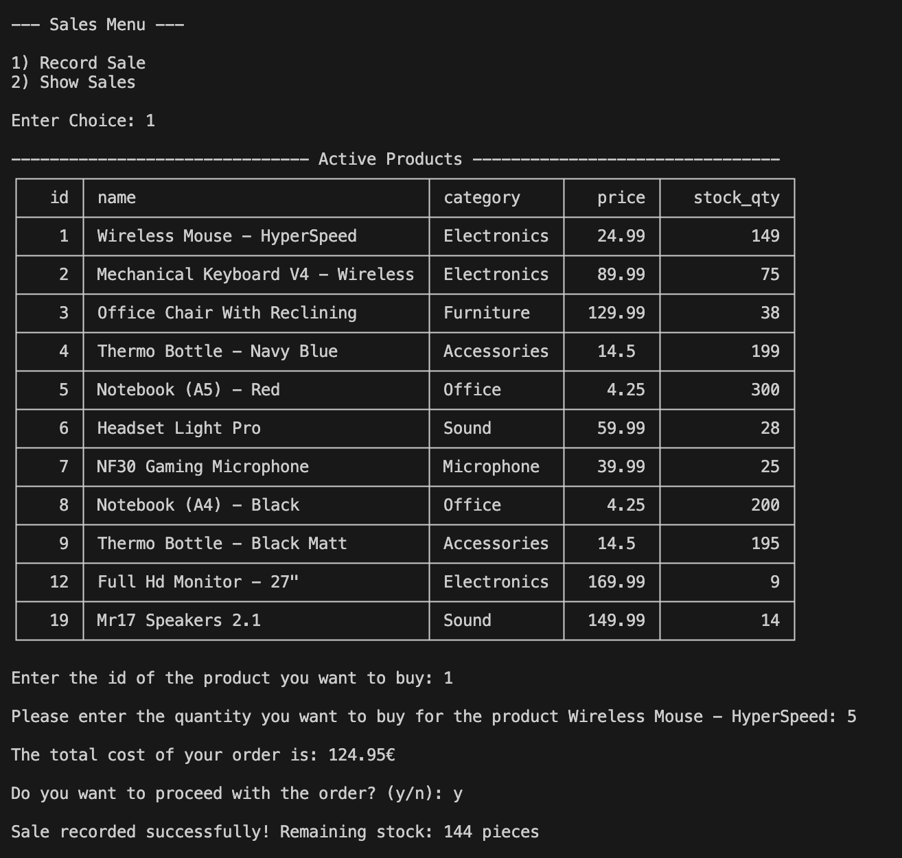
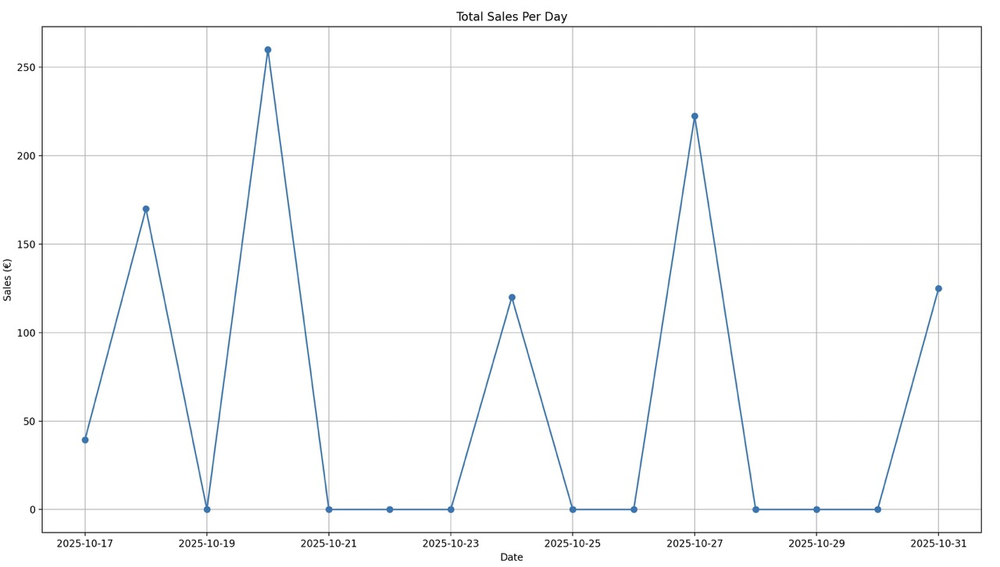

# Inventory and Sales Management System

A command-line Python app to manage products, suppliers and sales with reports, charts and CSV exports.

## Features

- Manage **Products** (add, update, delete, product list)
- Record and view **Sales**
- Manage **Suppliers** (add, update, delete), assign products, Supplier list
- Generate **Reports**:
    - Total revenue, Best sellers, sales trend, total orders
    - Stock and low-stock reports
    - Supplier and product coverage
- Export data to **CSV files**
- Modular structure with **SQLite** database

## Technologies Used

- **Python 3.13**
- **SQLite** for database management
- **Pandas** for data analysis
- **Matplotlib** for data visualization
- **Tabulate** for CLI tables
- **Email-Validator** for input validation
- **VS Code** as development environment

## Demo

### Main Menu

A simple command-line interface for navigating between product, sales, suppler features.



### Record Sale

Demonstrates the sale process, with product validation, total cost calculation and stock updates.



### Sales Trend Chart

Visual report showing daily total sales using Matplotlib



## Installation & Setup

1. **Clone the repository**
```bash
git clone https://github.com/NikosKl/Inventory-and-Sales-Management-System.git
cd Inventory-and-Sales-Management-System
```

2. Create and activate a virtual environment

python -m venv venv
source venv\bin\activate # on macOS/Linux
venv\Scripts\activate # on Windows

3. Install dependencies

pip install -r requirements.txt

4. Run the project

python -m src.main

##  Project Structure
```
./
├── data/
│ └── setup_db.py
├── exports/
│ ├── products_export_YYYY-MM-DD_HH_MM.csv
│ ├── sales_export_YYYY-MM-DD_HH_MM.csv
│ ├── supplierProducts_export_YYYY-MM-DD_HH_MM.csv
│ └── suppliers_export_YYYY-MM-DD_HH_MM.csv
├── inventory.sqlite
├── requirements.txt
├── README.md
├── src/
│ ├── init.py
│ ├── export_manager.py
│ ├── helpers.py
│ ├── main.py
│ ├── menu_manager.py
│ ├── product_manager.py
│ ├── reports_manager.py
│ ├── sales_manager.py
│ └── supplier_manager.py 
```

## Usage Guide

After running the project (`python -m src.main`), the main menu will appear:

--- Inventory Management system -- 

1. Products
2. Sales
3. Suppliers
4. Reports & Analytics
5. Exit

### Products

- Add, update, delete or view all products.
- Each product includes name, category, price and stock quantity

### Sales

- Record new sales, automatically updating product stock.
- View all recorded sales with product name, quantity and date

### Reports & Analytics

- **Sales Report** -> total revenue, best-selling products, total orders and sales trends (daily chart)
- **Inventory Reports** -> stock and low-stock items.
- **Supplier Reports** -> supplier coverage, product assignments and unassigned products.

### Export Data

Export Menu -> export Products, Sales, Suppliers or SupplierProducts to CSV (stored in the `\exports` folder).